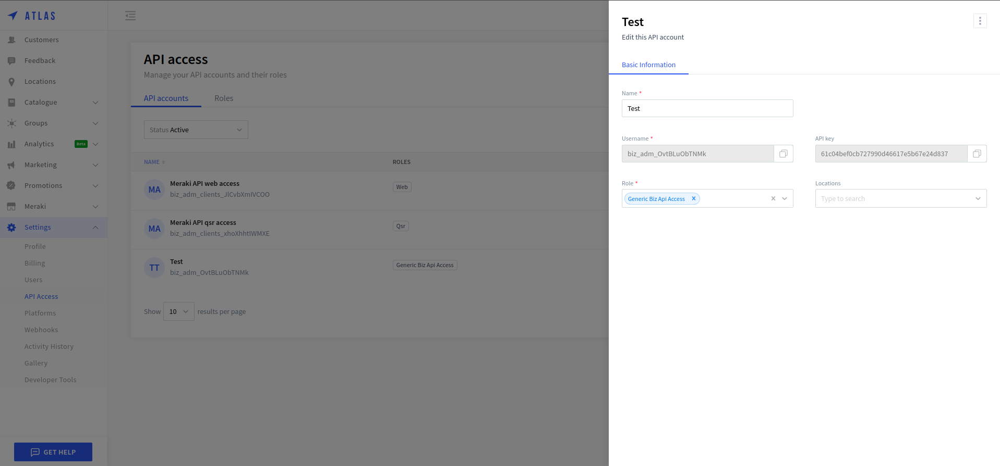

:show-content:

==========
UrbanPiper
==========

Integrating UrbanPiper allows you to seamlessly connect multiple delivery platforms, streamlining order management and improving operational efficiency. UrbanPiper is essential for businesses that manage multiple delivery platforms because it simplifies the entire process. Instead of handling separate systems for each delivery provider, UrbanPiper allows you to manage all orders from a single interface.

Configuration
=============

.. _urban_piper/credentials:

Locate your UrbanPiper credentials
----------------------------------

`Go to your atlas account <https://atlas-pos-int.urbanpiper.com>`_ and grab your api key and username.

You need the following credentials to set up the Point of Sale in Odoo:

- API key
- username

Configure your Point of Sale
----------------------------

#. :doc:`Activate the Point of Sale - UrbanPiper module <../../../../general/apps_modules>` to enable the UrbanPiper.
#. Go to the :ref:`POS'settings <configuration/settings>` and go to the Food Delivery Connector.

    #. Fill in the :guilabel:`API key and Username` field with the :ref:`Credentials
      <urban_piper/credentials:>`.
    .. image:: urban_piper/food_delivery_connector.png
        :align: center
        :alt: Food Delivery Connector

Create your location at atlas
-----------------------------

#. `Go to the locations <https://atlas-pos-int.urbanpiper.com/locations>`_ tab.
    .. image:: urban_piper/atlast_location.png
        :align: center
        :alt: Location menu

#. Click on :guilabel:`Add a new location` and enter the required details:
    .. image:: urban_piper/add_location.png
        :alt: Add new location

#. Go to your location and paste POS ID which is generated here - :ref:`urban_piper/urban_piper_api.png`:
    .. image:: urban_piper/add_location.png
        :alt: Add new location
